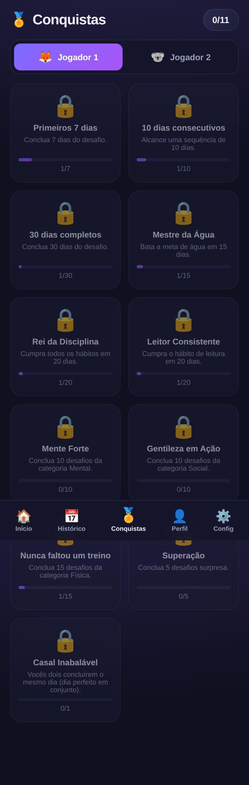

# 🎯 Questly — Desafio de Evolução

> App gamificado de **desafios diários** para casais evoluírem juntos — físico, mental, social, espiritual e na **relação**. Recompensa a **constância**, não a perfeição.

Questly transforma o "Desafio de Evolução de 30 dias" em um jogo: hábitos fixos,
desafios variáveis por categoria, desafios surpresa, pontuação, sequências (streaks),
dias perfeitos, ranking em tempo real entre os dois participantes e conquistas —
tudo numa interface **mobile-first** instalável como app (PWA).

<p align="center">
  
  
  
</p>

---

## ✨ Funcionalidades

- 🏠 **Tela inicial**: ranking, anel de progresso do dia, desafio do dia, surpresa e hábitos pendentes.
- 💪🧠🤝🙏💞 **5 categorias**: Física, Mental, Social, Espiritual e **Relação (casal)**.
- ✅ **Hábitos fixos** configuráveis (10 pts cada).
- 🎲 **Desafio do dia** variável, sorteado de forma **determinística por data** (os dois jogadores recebem o mesmo — competição justa).
- 🔥 **Desafio surpresa** com frequência ajustável.
- 🏆 **Ranking** com pontuação diária, semanal e total.
- 🔥 **Sequências (streaks)**, ⭐ **dias perfeitos** e **% de conclusão**.
- 🏅 **11 conquistas** com progresso (incluindo a **Casal Inabalável**).
- 📅 **Histórico**: calendário, gráfico de desempenho e evolução.
- 👤 **Perfil** por jogador (avatar, objetivo, peso, estatísticas).
- ⚙️ **Configurações**: metas (água, passos, proteína, calorias, sono), duração (30/60/75/90 dias), dias de descanso, categoria espiritual e frequência de surpresas.
- 📱 **PWA** instalável na tela inicial, feita para o celular.
- 🚫 **Sem pontuação negativa** — o foco é recuperar e continuar.

## 🧮 Sistema de pontuação

| Item | Pontos |
|---|---|
| Cada hábito fixo cumprido | **10** (padrão: 5 hábitos = 50) |
| Desafio do dia | **30** |
| Desafio surpresa (quando aparece) | **20** |
| Bônus por cumprir tudo do dia | **20** |
| **Máximo diário** | **120** (num dia com surpresa) |

- **Dia concluído** (conta para a sequência): todos os hábitos fixos + desafio do dia.
- **Dia perfeito** (ganha o bônus): tudo do dia, incluindo a surpresa quando houver.

## 🛠️ Tecnologias

- **Backend:** Python · FastAPI · SQLAlchemy 2 · SQLite
- **Frontend:** React 18 · Vite · React Router · PWA (vite-plugin-pwa)
- Interface **mobile-first**, tema escuro gamificado.

## 📂 Estrutura

```
questly/
├── backend/                # API FastAPI
│   ├── app/
│   │   ├── main.py         # rotas
│   │   ├── models.py       # ORM (Player, DayEntry, Settings)
│   │   ├── scoring.py      # pontuação, streaks e conquistas
│   │   ├── data.py         # hábitos, desafios, surpresas, conquistas
│   │   ├── schemas.py      # validação (Pydantic)
│   │   ├── seed.py         # banco inicial (2 jogadores)
│   │   └── database.py
│   └── requirements.txt
└── frontend/               # PWA React (Vite)
    └── src/
        ├── pages/          # Home, Perfil, Historico, Conquistas, Config
        ├── components/     # BottomNav, PlayerSwitch, ProgressRing
        ├── store.jsx       # estado global (Context)
        └── api.js          # cliente da API
```

## 🚀 Como rodar

### 1. Backend (API)

```bash
cd backend
python3 -m venv .venv
source .venv/bin/activate        # Windows: .venv\Scripts\activate
pip install -r requirements.txt
uvicorn app.main:app --reload --port 8000
```

A API sobe em `http://localhost:8000` (docs interativas em `/docs`). O banco SQLite
e os dois jogadores são criados automaticamente na primeira execução.

### 2. Frontend (app)

```bash
cd frontend
npm install
npm run dev
```

Abra `http://localhost:5173` no navegador (ou no celular, na mesma rede).
Para apontar para outra URL de API, crie um `.env` com:

```
VITE_API_URL=http://SEU_IP:8000
```

> 💡 Rode os dois ao mesmo tempo (dois terminais). No celular, use o IP da sua
> máquina na rede local e "Adicionar à tela inicial" para instalar como app.

## 🔌 Principais endpoints

| Método | Rota | Descrição |
|---|---|---|
| `GET` | `/api/state` | Payload agregado da tela inicial |
| `GET` | `/api/challenges/today` | Desafio do dia + surpresa |
| `POST` | `/api/day/{id}/toggle` | Marca/desmarca hábito ou desafio |
| `GET` | `/api/ranking` | Ranking dos jogadores |
| `GET` | `/api/history/{id}` | Calendário + desempenho |
| `GET` | `/api/achievements/{id}` | Conquistas com progresso |
| `GET` `PUT` | `/api/settings` | Configurações do desafio |
| `GET` `PUT` | `/api/players/{id}` | Perfil do jogador |

## 🗺️ Próximos passos (ideias)

- Autenticação e múltiplos casais/duplas.
- Notificações (lembretes de hábitos).
- Registro de água/passos/proteína com valores (não só ✔️).
- Gráficos de evolução semanal/mensal mais ricos.
- Deploy (backend no Render/Fly, frontend no Vercel/Netlify).

## 📄 Licença

MIT — veja [LICENSE](LICENSE).
